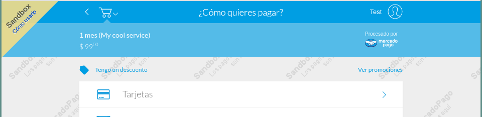
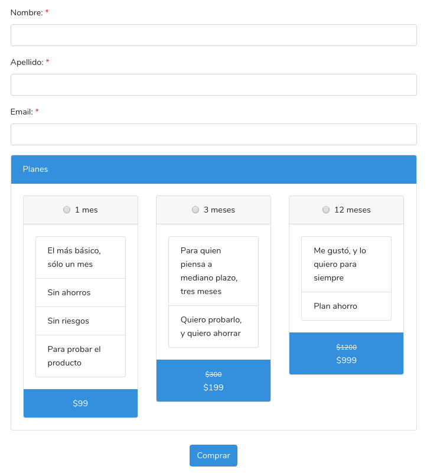

# 💰 Laravel MercadoPago Prepaid Subscriptions 💰

Dado que la sección sobre *suscripciones* (o *pagos recurrentes*) fue removida recientemente de la documentación de MercadoPago para desarrolladores, fue necesario crear una **alternativa**.

La funcionalidad de este paquete no es exactamente igual a la de las suscripciones típicas. En cambio, provee la lógica necesaria para implementar **suscripciones prepagas** dentro de una aplicación desarrollada en [Laravel](https://laravel.com).

## ¿Qué **NO** son las *suscripciones prepagas*?

No son el típico concepto de suscripción que utilizamos frecuentemente, donde uno se **suscribe** a un servicio o producto y paga un monto fijo cada cierto período de tiempo.

Ese modelo de pagos lo ofrece MercadoPago, pero la documentación de la API para poder integrar un sistema externo fue removida de la [página para developers](https://www.mercadopago.com.ar/developers).

## ¿Qué **SÍ** son las *suscripciones prepagas*?

Tal vez sea más fácil de entender alrededor del concepto de **fecha de vencimiento**. La implementación de este paquete funciona de la siguiente forma:

* Un **modelo** se asocia a una **cuenta de suscripción** (`account`)
* En el momento en que se registra esta asociación, se le asigna una **fecha de vencimiento** (`expiration_date`). Esta fecha de vencimiento inicial dependerá del valor configurable del **free trial**.
* La suscripción estará **activa** siempre que la fecha de vencimiento de la cuenta sea posterior a la fecha actual.
* Se ofrece la posibilidad de **extender** esta fecha de vencimiento con la compra de **planes** (configurables). Estos planes extienden la fecha de vencimiento por un **período de tiempo** a un **precio**.
* Se pueden comprar múltiples planes de forma consecutiva, extendiendo aún más la fecha de vencimiento.

### Ejemplo

* Un usuario crea una nueva cuenta el 1-ene-2019
* El **free trial** se encuentra configurado por 7 días. Por lo tanto, la **fecha de vencimiento** se asigna al 8-ene-2019

Situación inicial:

|                      |   cuenta   |
|---------------------:|:----------:|
| Fecha de vencimiento | 7-ene-2019 |
| Fecha de creación    | 1-ene-2019 |

* Los **planes** configurados son:

|                    | Plan 1 mes | Plan 6 meses | Plan 12 meses |
|-------------------:|:----------:|:------------:|:-------------:|
|  Extiende la fecha |    1 mes   |    6 meses   |    12 meses   |
|             Precio |     $99    |     $499     |      $999     |

* El usuario compra el **plan de 1 mes**, por lo que su cuenta quedará:

|                      |             cuenta            |
|---------------------:|:-----------------------------:|
| Fecha de vencimiento | ~~7-ene-2019~~ **7-feb-2019** |
|    Fecha de creación |           1-ene-2019          |

* El usuario compra el **plan de 12 meses**, por lo que su cuenta quedará:

|                      |             cuenta            |
|---------------------:|:-----------------------------:|
| Fecha de vencimiento | ~~7-feb-2019~~ **7-feb-2020** |
|    Fecha de creación |           1-ene-2019          |

* Si el usuario siguiera comprando planes, seguiría extendiendo su fecha de vencimiento (más allá de que no fuera necesario).

* Si el usuario no comprara más planes, su cuenta recién quedaría inhabilitada el 7-feb-2019. Hasta ese día su suscripción se encuentra activa.


## Instalación

Para instalar el paquete con `composer`:

```bash
composer require javoscript/laravel-mercadopago-prepaid-subscriptions

```

Correr las migraciones para generar las tablas necesarias en la base de datos:
```bash
php artisan migrate
```

Publicar la configuración
```bash
php artisan vendor:publish --provider="Javoscript\PrepaidSubs\PrepaidSubsServiceProvider" --tag=config
```

(Opcional) Publicar las vistas para customizarlas
```bash
php artisan vendor:publish --provider="Javoscript\PrepaidSubs\PrepaidSubsServiceProvider" --tag=views
```


## Configuración

### Variables de entorno
Agregar las variables de entorno en el archivo .env:
```
MP_PUBLIC_KEY=
MP_ACCESS_TOKEN=
MP_SANDBOX_PUBLIC_KEY=
MP_SANDBOX_ACCESS_TOKEN=
```

Estas se pueden obtener de [MercadoPago](https://www.mercadopago.com/mla/account/credentials).

### Configuración del paquete

Luego de publicar el archivo de configuración, se pueden editar los parámetros configurables en `config/prepaid-subs.php`. Estas variables son:

#### `service_name`
Indica el nombre del servicio que se está vendiendo. Se enviará en la descripción de la compra por MercadoPago.

#### `route_prefix`
Indica el prefijo que se usarán para las rutas utilizadas por el paquete.

Valor por defecto: `"prepaid-subs"`

#### `free_trial`
Indica el período que se ofrecerá como free trial.

Valor por defecto: `"7 days"`

Esta opción acepta `strings` con el mismo formato que la función `add()` del paquete `Carbon\Carbon`. Ver [Documentación](https://carbon.nesbot.com/docs/).

Algunos ejemplos válidos:
* `"1 week"`
* `"3 weeks"`
* `"2 months"`
* `"1 year"`


#### `sandbox_mode`
Indica si la integración con MercadoPago se realiza en modo de prueba.

Valor por defecto: `true`

Cuando esta variable tenga el valor `true`, se podrá obervar el cartelito de *Sandbox Mode* al proceder al pago con MercadoPago.

<p align="center">
    
</p>

<p align="center">
    Integración con MercadoPago en modo de prueba (*sandbox mode*)
</p>

#### `plans`
Indica los planes que ofrecerá el paquete. Se debe respetar el formato del `array` que se vé en el ejemplo.

```php
    "plans" => [
        [
            "name" => "1 mes",
            "time_value" => 1,
            "time_unit" => "month",
            "price" => 99,
            "old_price" => null,
            "details" => [
                "El más básico, sólo un mes",
                "Sin ahorros",
                "Sin riesgos",
                "Para probar el producto"
            ]
        ],
        [
            "name" => "3 meses",
            "time_value" => 3,
            "time_unit" => "month",
            "price" => 199,
            "old_price" => 300,
            "details" => [
                "Para quien piensa a mediano plazo, tres meses",
                "Quiero probarlo, y quiero ahorrar",
            ]
        ],
        [
            "name" => "12 meses",
            "time_value" => 12,
            "time_unit" => "month",
            "price" => 999,
            "old_price" => 1200,
            "details" => []
        ],
    ]
```

- `name` indica el nombre del plan
- `time_value` y `time_unit` indican el período de tiempo que se extenderá la fecha de vencimiento al comprar ese plan
- `price` indica el precio en pesos argentinos (ARS)
- `old_price` indica el precio anterior (o *sin descuento*)
- `details` es un *array* de *strings* que contiene características del plan

Todos estos valores estarán disponibles para usar en donde sea necesario en el código a través de objetos de la clase **Javoscript\PrepaidSubs\PrepaidPlan** (ver más adelante).

<p align="center">
    
</p>

<p align="center">
    `partial` inlcuido con el paquete: formulario con datos necesarios y elección de plan.
</p>

## Uso
TODO: add image

### Estructura general
TODO: completar

### Facade
TODO: completar

#### Cuentas
TODO: completar

#### Planes
TODO: completar

### Trait
(Opcional) El paquete incluye un Trait que se puede agregar a los modelos que se quieran relacionar con las cuentas de suscripciones
TODO: completar

### Views
El paquete incluye dos vistas a modo de ejemplo para la implementación del lado del frontend.

#### Planes
TODO: compoletar

#### Payments
TODO: completar

#### Cómo sobreescribir las vistas de callback
* Success
* Failure
* Pending

### Compra de un plan


## Licencia

MIT License (MIT). Ver [Licencia](LICENSE.md) para más información.
